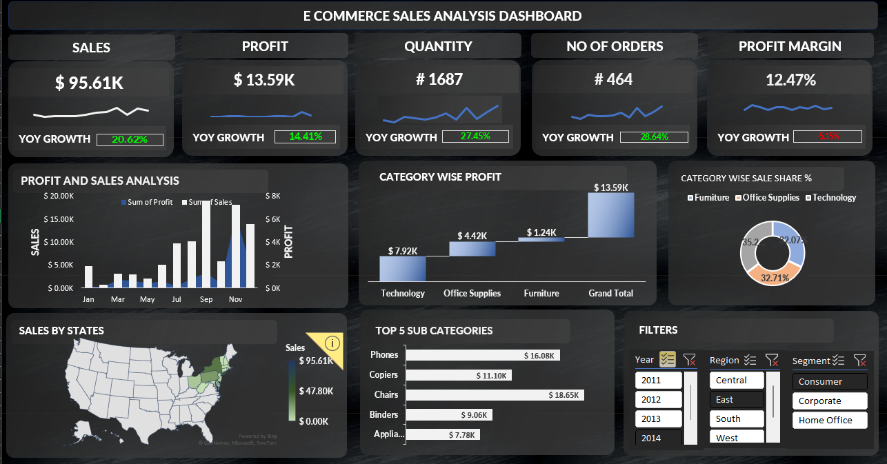

# 📊 E-Commerce Sales Dashboard

This Excel dashboard provides a visual analysis of e-commerce sales data across multiple years, regions, and segments.

### ✅ Key Metrics
- **Sales:** $95.61K (+20.62% YoY)
- **Profit:** $13.59K (+14.41% YoY)
- **Orders:** 464 (+28.64% YoY)
- **Quantity Sold:** 1,687 (+27.45% YoY)
- **Profit Margin:** 12.47% (-5.15% YoY)

### 📈 Features
- Filters by Year, Region, and Segment
- Sales & Profit Trends by Month
- State-wise Sales Map
- Category/Subcategory Profit Breakdown
- Category-wise Sales Share %

### 📁 Files
- `EcommerceDashboard.xlsx` – Main Excel file
- `dashboard.jpg` – Screenshot of the dashboard

### 🛠️ Requirements
- Microsoft Excel 2016 or later

### 📸 Preview

